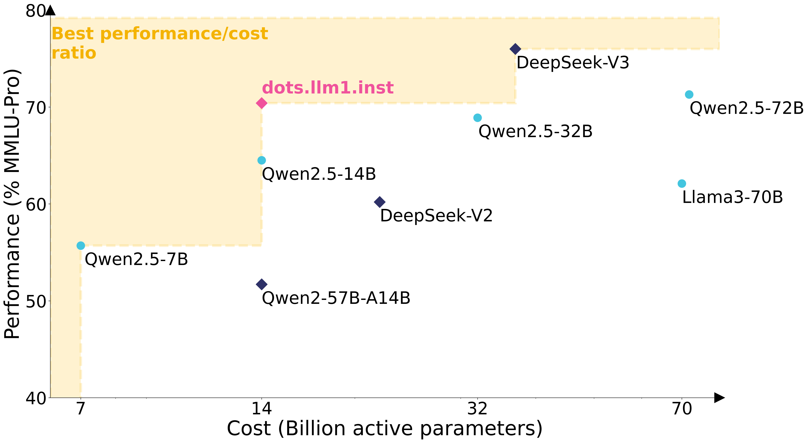

# dots1

<p align="center">
    
<p>

<p align="center">
    &nbsp&nbsp🤗 <a href="https://huggingface.co/rednote-hilab">Hugging Face</a>&nbsp&nbsp | &nbsp&nbsp 📑 <a href="https://github.com/rednote-hilab/dots.llm1/blob/main/dots1_tech_report.pdf">Paper</a> &nbsp&nbsp 
<br>
🖥️ <a href="https://huggingface.co/spaces/rednote-hilab/dots-demo">Demo</a>&nbsp&nbsp | &nbsp&nbsp💬 <a href="TBD">WeChat (微信)</a>&nbsp&nbsp | &nbsp&nbsp📕 <a href="TBD">rednote</a>&nbsp&nbsp
</p>


Visit our Hugging Face (click links above), search checkpoints with names starting with `dots.llm1` or visit the [dots1 collection](https://huggingface.co/collections/rednote-hilab/dotsllm1-68246aaaaba3363374a8aa7c), and you will find all you need! Enjoy!


## News

- 2025.06.06: We released the `dots.llm1` series. Check our [report](https://github.com/rednote-hilab/dots.llm1/blob/main/dots1_tech_report.pdf) for more details!


## 1. Introduction


The `dots.llm1` model is a large-scale MoE model that activates 14B parameters out of a total of 142B parameters, delivering performance on par with state-of-the-art models. 
Leveraging our meticulously crafted and efficient data processing pipeline, `dots.llm1` achieves performance comparable to Qwen2.5-72B after pretrained on 11.2T high-quality tokens without synthetic data. To foster further research, we open-source intermediate training checkpoints at every one trillion tokens, providing valuable insights into the learning dynamics of large language models.


<p align="center">
  
</p>

## 2. Model Summary

**This repo contains the base and instruction-tuned `dots.llm1` model**. which has the following features:

- Type: A MoE model with 14B activated and 142B total parameters trained on 11.2T tokens.
- Training Stages: Pretraining and SFT.
- Architecture: Multi-head Attention with QK-Norm in attention Layer, fine-grained MoE utilizing top-6 out of 128 routed experts, plus 2 shared experts.
- Number of Layers: 62
- Number of Attention Heads: 32
- Context Length: 32,768 tokens
- License: MIT

The highlights from `dots.llm1` include:

- **Enhanced Data Processing**: We propose a scalable and fine-grained *three-stage* data processing framework designed to generate large-scale, high-quality and diverse data for pretraining.
- **No Synthetic Data during Pretraining**: *11.2 trillion* high-quality non-synthetic tokens was used in base model pretraining.
- **Performance and Cost Efficiency**: `dots.llm1` is an open-source model that activates only *14B* parameters at inference, delivering both comprehensive capabilities and high computational efficiency.
- **Infrastructure**: We introduce an innovative MoE all-to-all communication and computation overlapping recipe based on interleaved 1F1B pipeline scheduling and an efficient grouped GEMM implementation to boost computational efficiency.
- **Open Accessibility to Model Dynamics**: Intermediate model checkpoints for *every 1T tokens* trained are released, facilitating future research into the learning dynamics of large language models.

## 3. Example Usage

### Model Downloads

<div align="center">

| **Model** | **#Total Params** | **#Activated Params** | **Context Length** | **Download Link** |
| :------------: | :------------: | :------------: | :------------: | :------------: |
| dots.llm1.base | 142B | 14B | 32K   | [🤗 Hugging Face](https://huggingface.co/rednote-hilab/dots.llm1.base)   |
| dots.llm1.inst  | 142B | 14B |  32K   | [🤗 Hugging Face](https://huggingface.co/rednote-hilab/dots.llm1.inst)   |

</div>

### Docker (recommended)


The docker images are available on Docker Hub as `https://hub.docker.com/repository/docker/rednotehilab/dots1/tags`, based on the official images.

You can start a server via vllm.

```shell
docker run --gpus all \
    -v ~/.cache/huggingface:/root/.cache/huggingface \
    -p 8000:8000 \
    --ipc=host \
    rednotehilab:dots1:vllm-openai-v0.9.0.1 \
    --model rednotehilab/dots.llm1.inst \
    --tensor-parallel-size 8 \
    --trust-remote-code \
    --served-model-name dots1
```

Then you can verify whether the model is running successfully in the following way.

```shell
curl http://localhost:8000/v1/chat/completions \
    -H "Content-Type: application/json" \
    -d '{
        "model": "dots1",
        "messages": [
            {"role": "system", "content": "You are a helpful assistant."},
            {"role": "user", "content": "Who won the world series in 2020?"}
        ],
        "max_tokens": 32,
        "temperature": 0
    }'
```


### Inference with huggingface

#### Text Completion

```python
import torch
from transformers import AutoTokenizer, AutoModelForCausalLM, GenerationConfig

model_name = "rednote-hilab/dots.llm1.base"
tokenizer = AutoTokenizer.from_pretrained(model_name)

model = AutoModelForCausalLM.from_pretrained(model_name, device_map="auto", torch_dtype=torch.bfloat16, attn_implementation="eager")
model.generation_config = GenerationConfig.from_pretrained(model_name)

text = "An attention function can be described as mapping a query and a set of key-value pairs to an output, where the query, keys, values, and output are all vectors. The output is"
inputs = tokenizer(text, return_tensors="pt")
outputs = model.generate(**inputs.to(model.device), max_new_tokens=100)
result = tokenizer.decode(outputs[0], skip_special_tokens=True)
print(result)
```

#### Chat Completion

```python
import torch
from transformers import AutoTokenizer, AutoModelForCausalLM, GenerationConfig

model_name = "rednote-hilab/dots.llm1.inst"
tokenizer = AutoTokenizer.from_pretrained(model_name)

model = AutoModelForCausalLM.from_pretrained(model_name, device_map="auto", torch_dtype=torch.bfloat16, attn_implementation="eager")
model.generation_config = GenerationConfig.from_pretrained(model_name)

messages = [
    {"role": "user", "content": "Write a piece of quicksort code in C++"}
]
input_tensor = tokenizer.apply_chat_template(messages, add_generation_prompt=True, return_tensors="pt")
outputs = model.generate(input_tensor.to(model.device), max_new_tokens=200)

result = tokenizer.decode(outputs[0][input_tensor.shape[1]:], skip_special_tokens=True)
print(result)
```


### Inference with sglang
[SGLang](https://github.com/sgl-project/sglang) is a fast serving framework for large language models and vision language models. SGLang could be used to launch a server with OpenAI-compatible API service. `sglang>=***` is required. It is as easy as

```shell
python -m sglang.launch_server --model-path dots.llm1.inst --tp 8 --host 0.0.0.0 --port 8000
```
An OpenAI-compatible API will be available at `http://localhost:8000/v1`.

### Inference with vllm
[vLLM](https://github.com/vllm-project/vllm) is a high-throughput and memory-efficient inference and serving engine for LLMs. `vllm>=***` is recommended.

```shell
vllm serve dots.llm1.inst --port 8000 --tensor-parallel-size 8
```
An OpenAI-compatible API will be available at `http://localhost:8000/v1`.

## 4. Evaluation Results

Detailed evaluation results are reported in this [📑 report](https://github.com/rednote-hilab/dots.llm1/blob/main/dots1_tech_report.pdf).

## Citation

If you find `dots.llm1` is useful or want to use in your projects, please kindly cite our paper:

```
@article{dots1,
      title={dots.llm1 Technical Report}, 
      author={rednote-hilab},
      journal={arXiv preprint arXiv:TBD},
      year={2025}
}
```
